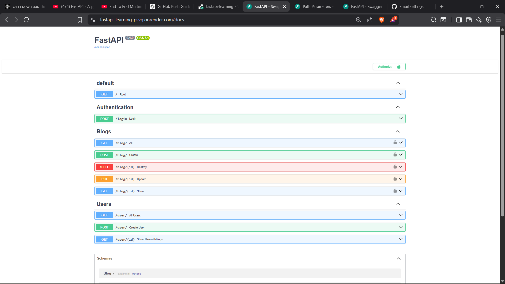
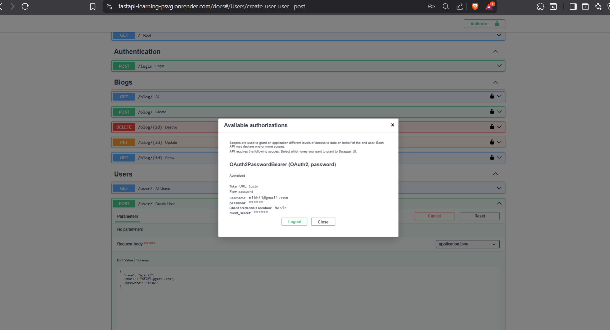
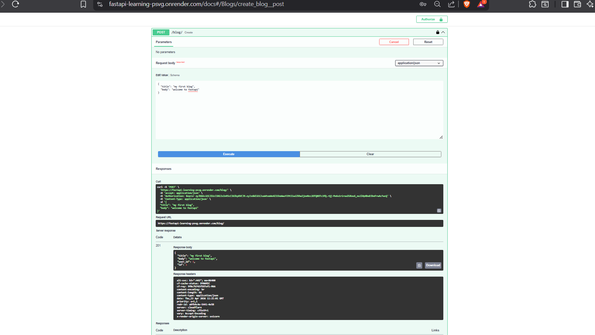

# fastapi-learning
# 🚀 FastAPI Learning Project

A backend API built using **FastAPI** and deployed on Render.

---

## 🌐 Live API

🔗 https://fastapi-learning-psvg.onrender.com/

---

## 📚 API Documentation

* Swagger UI:
  https://fastapi-learning-psvg.onrender.com/docs

* ReDoc:
  https://fastapi-learning-psvg.onrender.com/redoc

---


## 📌 Features

- ⚡ High-performance REST APIs using FastAPI  
- 🧩 Clean architecture with routers and repository pattern  
- 🔐 Secure authentication using JWT tokens  
- 🧑‍💼 User registration and management  
- 📝 Blog management system with full CRUD functionality  
- 🗃️ ORM-based database handling with SQLAlchemy  
- ✅ Data validation using Pydantic models  
- 📖 Interactive API docs (Swagger UI & ReDoc)  
- ☁️ Cloud deployment for real-world access  
- 🔄 Scalable and maintainable backend structure  
* Deployed on Render

---

## 📁 Project Structure

```
fastapi-learning/
├── app/
│ ├── main.py
│ ├── database.py
│ ├── models.py
│ ├── schemas.py
│ ├── routers/
│ │ ├── authentication.py
│ │ ├── blog.py
│ │ └── user.py
│ └── repositories/
│ ├── blog.py
│ └── user.py
├── images/
├── requirements.txt
├── README.md
└── .gitignore
```

---

## ⚙️ Installation (Local Setup)

### 1. Clone the repository

```
git clone https://github.com/pnikhilkumarnaik/fastapi-learning.git
cd fastapi-learning
```

---

### 2. Create virtual environment

```
python -m venv fastapi-learning
```

Activate it:

**Windows:**

```
source venv\Scripts\activate
```


---

### 3. Install dependencies

```
pip install -r requirements.txt
```

---

## ▶️ Run Locally

```
uvicorn app.main:app --reload
```

Open:

```
http://127.0.0.1:8000
```

---

## 🔐 Environment Variables

Create a `.env` file:

```
SECRET_KEY=your_secret_key
ALGORITHM=HS256
DATABASE_URL=sqlite:///./blog.db
```

---

## 🚀 Deployment (Render)

* Build Command:

```
pip install -r requirements.txt
```

* Start Command:

```
uvicorn app.main:app --host 0.0.0.0 --port 10000
```

---

## 📸 Screenshots

### 🔹 API Home


### 🔹 Swagger UI


### 🔹 API Response


## 🛠️ Tech Stack

* Python
* FastAPI
* SQLAlchemy
* Uvicorn

---

## 👨‍💻 Author

**P Nikhil Kumar Naik**
GitHub: https://github.com/pnikhilkumarnaik

---

## ⭐ Future Improvements

- 🔐 Enhance authentication with refresh tokens and role-based access control  
- 🗄️ Migrate from SQLite to PostgreSQL for production use  
- 🐳 Add Docker support for containerized deployment  
- ⚡ Implement caching (Redis) for better performance  
- 📊 Add logging and monitoring for debugging and analytics  
- 🧪 Write unit and integration tests (pytest)  
- 📦 Implement service layer for better architecture separation  
- 🔄 Add CI/CD pipeline for automated deployment  
- 🌍 Integrate frontend (React / Next.js)  
- 📁 File upload support (images for blogs)  
